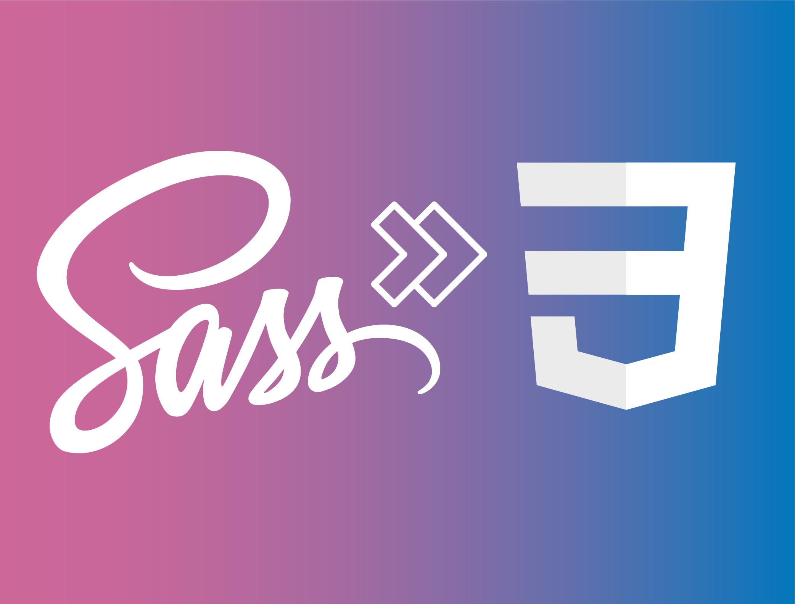
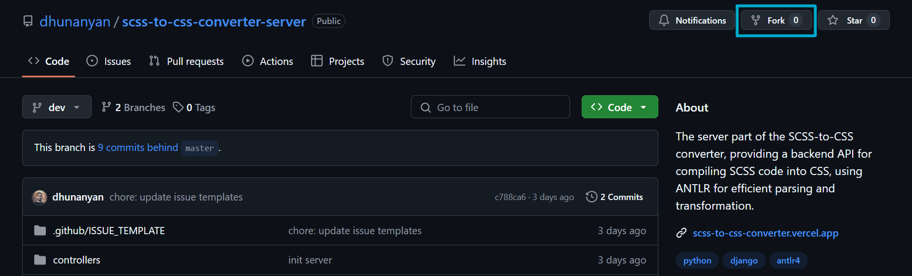

# SCSS to CSS Converter - Server

Welcome to the **SCSS to CSS Converter - Server**! This project is a lightweight, user-friendly tool designed to make converting SCSS (Sassy CSS) code to CSS (Cascading Style Sheets) simple and accessible. With this converter, you can work with SCSS syntax and quickly generate the final CSS code for easy deployment and browser compatibility.



## 📖 About

CSS preprocessors like SCSS allow for more flexible, modular, and maintainable styling by providing features such as variables, nested rules, and mixins. However, the final output for browsers needs to be in plain CSS. This converter bridges that gap, helping you transition smoothly from SCSS to CSS.

## ✨ Features

- **Simple and intuitive**: Minimal setup required to convert SCSS files to CSS.
- **Browser-ready output**: Easily transform SCSS code to CSS format.
- **Flexible styling**: Retain the powerful features of SCSS while preparing styles for production.

## 🚀 Getting Started

### Fork the repository

1. On GitHub, navigate to the [dhunanyan/scss-to-css-converter-server](https://github.com/dhunanyan/scss-to-css-converter-server/tree/dev) repository.
2. In the top-right corner of the page, click Fork.
   
3. Under "Owner," select the dropdown menu and click an owner for the forked repository.
4. By default, forks are named the same as their upstream repositories. Optionally, to further distinguish your fork, in the "Repository name" field, type a name.
5. Optionally, in the "Description" field, type a description of your fork.
6. Optionally, select `Copy the DEFAULT` branch only.
   For many forking scenarios, such as contributing to open-source projects, you only need to copy the default branch. If you do not select this option, all branches will be copied into the new fork.
7. Click `Create fork`.

### Clone the repository

```bash
git clone https://github.com/dhunanyan/scss-to-css-converter-server.git
```

## ⚙️ Local setup

### 1. Setting up SCSS compiler (Optional)

Since some of you may not have `antlr4` on your local machine in order to build the scss compiler - the `parser/` folder has been removed from `.gitignore`, so you can find it on `master`.
However if you are interested in building the compiler on your local machine you should install `antlr4` on your local machine.

#### - Install `ANTLR4` (Window)

> - Go to [ANTLR4 Official Website](https://www.antlr.org)
> - Go to [Downloads](https://www.antlr.org/download.html)
> - Find the latest version, which satisfies the project requirements and download it and configure on your local machine

#### - Install `ANTLR4` (MacOS)

> ```bash
> brew install antlr
> $ antlr4
> # ANTLR Parser Generator Version 4.X.X
> # ...
> ```

#### - Build SCSS Compiler

> ```bash
> cd scss-to-css-converter
> sh scripts/converter_build.sh
> ```
>
> **🚨 `parser/` folder in project root will be deleted and will be replaced with the new generated one**

### 2. Install `NodeJS v20+`

In order to install and run the project you should have `Node.js 20` on your local machine

#### - Install `NodeJS v20+` (Windows)

> If you have `nvm` you can simply switch to a different version by running:
>
> ```bash
> nvm install 20
> nvm use 20
> ```
>
> if not then quickest way to download it from [here](https://nodejs.org/en/download/prebuilt-installer/current)

#### - Install `NodeJS v20+` (MacOS)

> ```bash
> brew install nvm
> nvm install 20
> nvm use 20
> ```

### 3 Install projects dependencies

Run in project root:

```bash
yarn install
```

## 🔨 Local run

Run in project root:

```bash
yarn start:dev
```

Project will be running on `https://localhost:3000`

#### Available roots:

| **Route**      | **Description**                                                                                          |
| -------------- | -------------------------------------------------------------------------------------------------------- |
| `/`            | Overview page, with all the instructions                                                                 |
| `/healthcheck` | Simple healthcheck route which returns the version of server                                             |
| `/convert`     | The main route were all the magic happens. Here you send API requests. Please see a sample request below |

#### Example of an API request:

🔔 You can call this inside browser console:

```js
// API Request function
const convert = async (data) => {
  try {
    const res = await fetch('http://localhost:3000/convert', {
      method: 'POST',
      headers: { 'Content-Type': 'application/json' },
      body: JSON.stringify({ data }),
    });
    const json = await res.json();
    return json.data;
  } catch (error) {
    console.error('Error:', error);
    return null;
  }
};

// Sample SCSS Code
const scssCode = `
body {
    background-color: red;
    font-size: 14px;
    color: yellow;
    font-size: 14px;
    line-height: 24px;

    ul {
        color: green;

        &.card {
            width: 10px;

            &--dark{
                &:first-of-type {
                    border-radius: 20px;
                }
                border: 1px solid #000;
            }
        }

        height: 20px;
    }

    text-transform: underline;
}`;

// Calling the the function with SCSS Code param
(await convert(scssCode))['data'];
```

#### Example of an API response

🔔 `isValid` - tells wether the SCSS code (which was the param for the request) is valid or not

🔔 `data` - CSS code (converted from SCSS)

```json
{
  "isValid": true,
  "data": "body {\n\tbackground-color: red;\n\tfont-size: 14px;\n\tcolor: yellow;\n\tfont-size: 14px;\n\tline-height: 24px;\n\ttext-transform: underline;\n}\n\nbody ul {\n\tcolor: green;\n\theight: 20px;\n}\n\nbody ul.card {\n\twidth: 10px;\n}\n\nbody ul.card--dark {\n\tborder: 1px solid #000;\n}\n\nbody ul.card--dark:first-of-type {\n\tborder-radius: 20px;\n}"
}
```

## 🛠️ Build

Run in project root:

```bash
yarn build:server
```

## 💬 Feedback

We'd love to hear how you're using the SCSS to CSS Converter - Server! Feel free to contribute or open issues if you have ideas to improve it.

### Happy styling! 🌟
